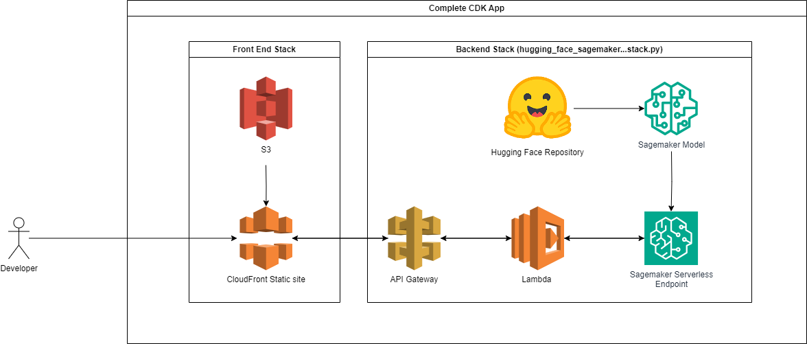

# CDK Sample: Deploy a Hugging Face Transformer model to Amazon Sagemaker - SERVERLESS!

This repo deploys a full serverless stack for testing hugging face models from a front end using the AWS cdk.

It uses a static webpage that hits an endpoint using HTMX to handle the api via api gateway and lambda to a SageMaker Serverless Endpoint. To set the endpoint you want to deploy from the cmd line you can provide your `model` , `task` for the model you want to deploy from huggingface.co/models as input `parameters`, in addition you should provide a short name for the model you are deploying. The Stack will create an IAM Role with the required permissions to execute your endpoint, a SageMaker Model, a SageMaker Endpoint Configuration and the Endpoint itself. 

The current limitations are that not all hugging face models are supported by SageMaker, and that there is a maximum ram size of 6gb. So the model you select will need to fit on that! In practical terms that means that most large language models are not supported.

Have fun!



## Get started 

clone the repository 
```bash
git clone https://github.com/whitew1994WW/aws-cdk-serverless-hugging-face.git
```

Install the cdk required dependencies. Make your you have the [cdk](https://docs.aws.amazon.com/cdk/latest/guide/getting_started.html#getting_started_install) installed.
```bash
pip3 install -r requirements.txt
```

Add your AWS Account ID and region to a config.ini file - e.g.
```bash
[AWS_ACCOUNT_INFO]
AWS_ACCOUNT_ID = 777777777777
AWS_REGION = eu-west-1
```


[Bootstrap](https://docs.aws.amazon.com/cdk/latest/guide/bootstrapping.html) your application in the cloud.

```bash
cdk bootstrap
```

Deploy your Hugging Face Transformer model to Amazon SageMaker

```bash
cdk deploy --parameters model="distilbert-base-uncased-finetuned-sst-2-english" --parameters task="text-classification" --parameters modelShortName="text-classification" --all
```
